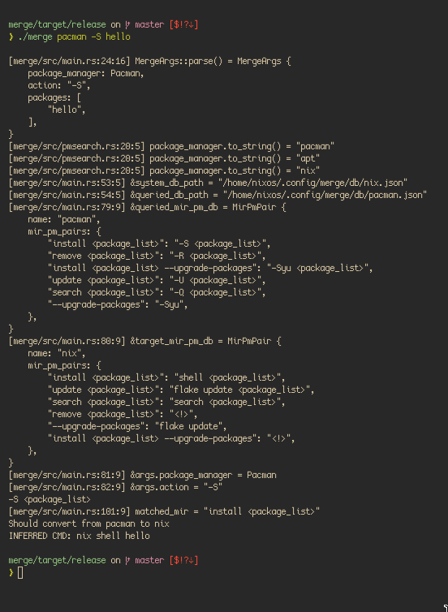

# Bulgular

> Çalışmada toplanan veriler ve verilere ait analiz sonuçları verilir.

Projemizin çalışır haldeki asciinema klibini izlemek için: <https://asciinema.org/a/630971>

## Büyük O notasyonu

`merge`, Performans açısından muadillerine karşı üstünlük elde etmiştir.

Öyle ki `mew` paket çevirmeni, büyük O notasyonu hacim uzay karmaşıklığı (Space Complexity) `O(n)` iken
spesifik olarak hacimsel optimizasyon ile `MgMIR` aynı işlemi düz uzay (optimum karmaşa) olan `O(1)`
ile gerçekleştirebilmektedir.

## Kaynak Kodu

`merge`, tamamen ücretsiz ve açık kaynak bir yazılımdır.
Kaynak kodu için [Ek2'ye](https://github.com/orhnk/merge) bakınız.

## Loglar

`merge` çalışırken oluşabilecek sıkıntılar için yapılan işlemi anlık olarak kullanıcıya bildirmektedir.

Aşağıda Rust'ın standart kütüphanesinden `dbg!()` makrosunun çıktıları verilmiştir:

Fotoğrafta verildiği üzere oluşturulan son komut kullanıcıya `INFERRED CMD: <komut>` şeklinde bildirilmektedir.